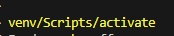
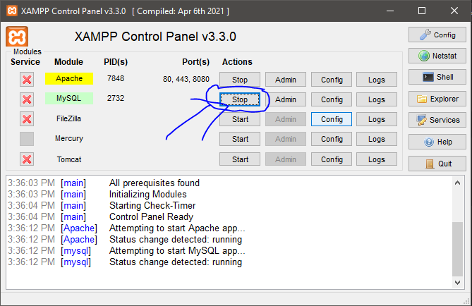
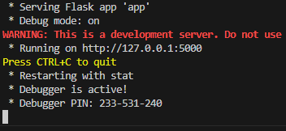
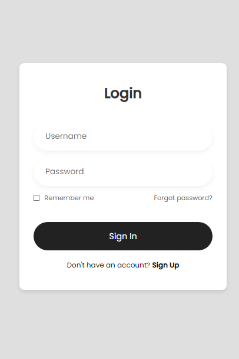
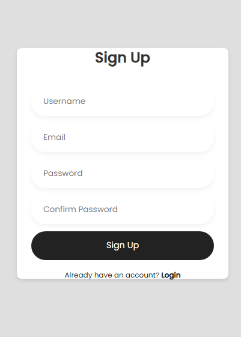
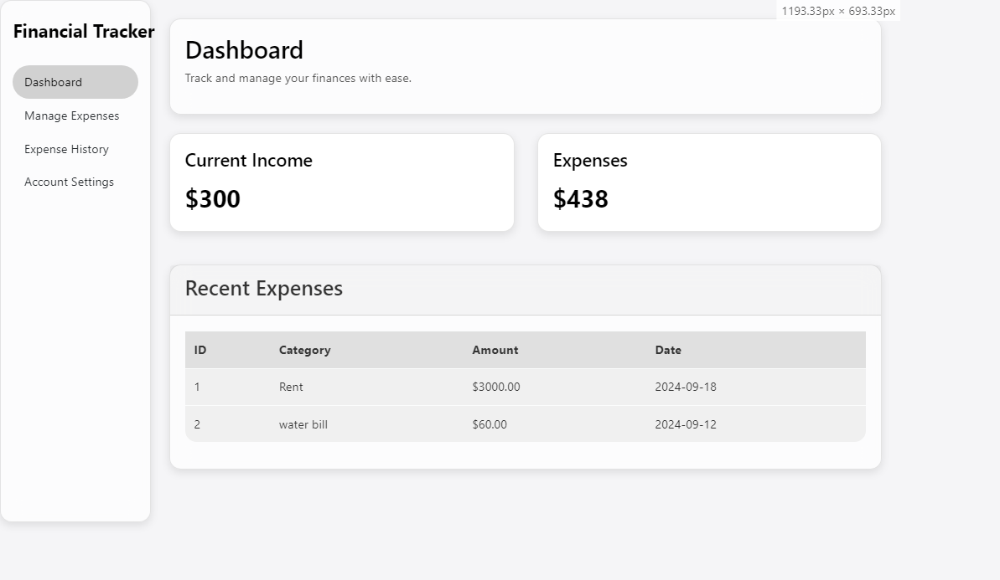
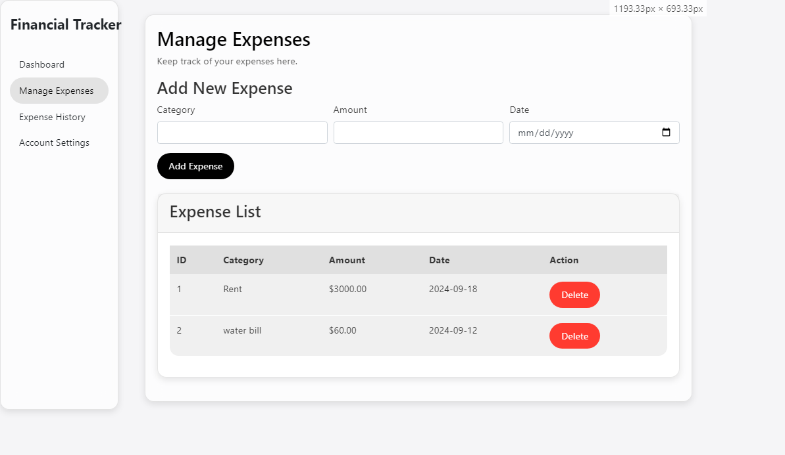

# Personal Financial Tracker

## Overview

This Flask application is designed to help users manage their personal finances. It allows users to sign up, log in, add and delete expenses, and view a dashboard of their financial activities. Users can also update their account details.

## Features

- **User Authentication**: Sign up, log in, and log out functionality.
- **Expense Management**: Add, view, and delete expenses.
- **Account Management**: Update user details.

## Requirements

- Python 3.x
- Flask
- MySQL Connector
- XAMPP local server

## How to set it up
 - Create and Activate Your Virtual Environment.

 

 - Install the required packages such as Flask and MySQL Connector.
 - Download and install XAMPP manually. Once installed, start the MySQL service.

 

 - Run the auto_create_database.py script to set up the database for the project. Ensure you use the correct server credentials (the default credentials are provided in the script).
 - Run the flask application.
 
 

## Preview

Below are previews of the authentication pages `1.png` and `2.png`.

 

Below are previews of the dashboard and the management page `3.png` and `4.png`.

 
